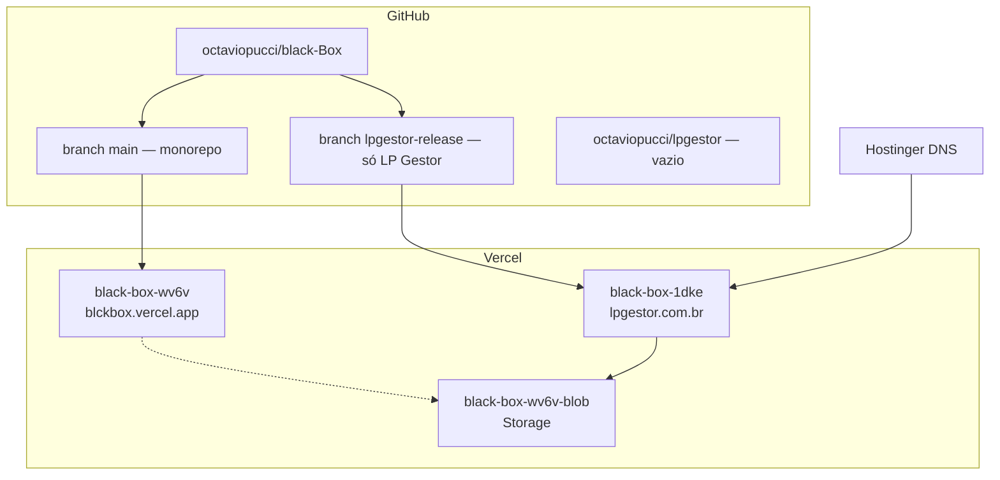

# Estrutura completa — LP Gestor / Black Box

Documento de referência da arquitetura em produção e no código (atualizado em set/2026).

---

## Visão geral

Existem **dois “mundos”** convivendo:

| Mundo | Função |
|-------|--------|
| **Monorepo black-Box** | Plataforma com vários clientes (Maciel, portal, demos…) |
| **LP Gestor standalone** | Produto só do gestor de lojas, na branch `lpgestor-release` |

O domínio **`lpgestor.com.br`** aponta para um **projeto Vercel separado**, não para o black-Box geral.



---

## 1. GitHub

### Repositório principal: `octaviopucci/black-Box`

| Branch | Conteúdo | Uso |
|--------|----------|-----|
| **`main`** | Monorepo inteiro | Deploy `blckbox.vercel.app` |
| **`lpgestor-release`** | Só LP Gestor na raiz | Deploy `lpgestor.com.br` |
| **`cursor/*`** | Features em andamento | PRs diversos |

### Repositório `octaviopucci/lpgestor`

- Criado manualmente, **ainda vazio** (só README placeholder)
- Código real está na branch **`lpgestor-release`** do black-Box
- PRs auxiliares no monorepo: **#104** (scripts export), **#105** (workflow sync)

---

## 2. Vercel (produção)

| Projeto | URL | Repo / branch | O que roda |
|---------|-----|---------------|------------|
| **`black-box-wv6v`** | https://blckbox.vercel.app | `black-Box` → **`main`** | Todos os projetos (Maciel, LP em `/lp-motors/`, portal, PIX…) |
| **`black-box-1dke`** | https://black-box-1dke.vercel.app | `black-Box` → **`lpgestor-release`** | **Só LP Gestor** |
| Domínio | **https://lpgestor.com.br** | → `black-box-1dke` | Cliente final |

### Storage (Blob)

| Blob | Projeto conectado | Dados |
|------|-------------------|-------|
| **`black-box-wv6v-blob`** | `black-box-1dke` (+ legado wv6v) | Lojas, usuários, estoque (`lp-motors/store.json`) |

### Health check

```bash
curl -s https://lpgestor.com.br/api/lp-motors/health
```

Esperado: `"ok": true`, `"blob": true`

---

## 3. DNS (Hostinger)

| Tipo | Nome | Valor |
|------|------|--------|
| **A** | `@` | `76.76.21.21` |
| **CNAME** | `www` | `cname.vercel-dns.com` |

`lpgestor.com.br` redireciona para `www.lpgestor.com.br` (config Vercel).

---

## 4. Código — monorepo (`main`)

```
black-Box/
├── apps/
│   ├── lp-motors-gestor/     ← LP Gestor (frontend React)
│   ├── maciel-motors-gestor/ ← Maciel (produto separado)
│   ├── pix-gateway/
│   └── … (15+ demos/clientes)
├── api/
│   ├── lp-motors.ts          ← API serverless LP Gestor
│   └── _lp-motors/
│       ├── store.ts          ← Blob + multi-tenant
│       ├── fipe.ts           ← FIPE / placa
│       └── tenant.ts
├── portal/                   ← Portal Black Box
├── scripts/
│   ├── assemble-dist.mjs     ← Monta public/ no deploy
│   └── bundle-pix-api.mjs
├── public/                   ← Build final (Vercel output)
├── vercel.json               ← Rotas de todos os projetos
└── package.json              ← build:lp-motors, vercel-build…
```

**LP Gestor no monorepo:** https://blckbox.vercel.app/lp-motors/

**Domínio no monorepo (`main`):** rewrite `lpgestor.com.br` → `/lpgestor/` (legado; domínio hoje está no projeto separado).

---

## 5. Código — standalone (`lpgestor-release`)

Branch exportada — **app na raiz**, sem pasta `apps/`:

```
lpgestor-release/   (raiz do repo nesta branch)
├── src/              ← React (mesmo app, base /)
├── api/
│   ├── lp-motors.ts
│   ├── package.json  ← CommonJS (fix API Vercel)
│   └── _lp-motors/
├── public/
├── dist/             ← Build Vercel (output)
├── vercel.json       ← SPA + API /api/lp-motors/*
├── package.json
├── DOMAIN.md
└── DEPLOY.md
```

### Fixes recentes (branch `lpgestor-release`)

- Redirect loop www/apex corrigido
- API CommonJS (`api/package.json`)
- Cadastro com acentos no usuário
- Persistência Blob (cadastro na nuvem de verdade)
- Código da loja fixo (Configurações, pós-cadastro, header)

---

## 6. LP Gestor — app (funcional)

### URLs produção

| Página | URL |
|--------|-----|
| App | https://lpgestor.com.br/ |
| Login | https://lpgestor.com.br/login |
| Cadastro | https://lpgestor.com.br/cadastro |
| API | https://lpgestor.com.br/api/lp-motors/* |

### Módulos / rotas

| Área | Rotas |
|------|--------|
| Principal | `/`, `/estoque`, `/alertas`, `/inteligencia`, `/fipe` |
| Operação | `/preparacao`, `/documentos`, `/fornecedores`, `/veiculos/*` |
| Financeiro | `/financeiro`, `/contas`, `/rentabilidade`, `/clientes` |
| Admin | `/usuarios`, `/configuracoes`, `/auditoria`, `/backup`, `/relatorios` |

### Stack

| Camada | Tecnologia |
|--------|------------|
| Frontend | React 18 + Vite + TypeScript + Tailwind + Framer Motion |
| Backend | Vercel Serverless (`api/lp-motors.ts`) |
| Dados | Vercel Blob (JSON multi-tenant) + localStorage (cache/sync) |
| Auth | Cadastro por loja → usuário + senha + **código da loja** (slug) |

### Multi-tenant

- Cada loja = 1 `organization` + usuários + database isolado no Blob
- Login em outro aparelho = **usuário + senha + código da loja**
- Sync automática (~30s, focus, online)

### Onde ver o código da loja

| Local | Quando |
|-------|--------|
| Tela pós-cadastro | Imediatamente após criar a loja |
| **Configurações → Nuvem** | Permanente |
| Header (desktop) | Abaixo do nome da loja |

---

## 7. Fluxo login / cadastro / nuvem

```
Cadastro (/cadastro)
    → API POST /auth/register
    → Grava no Blob (lp-motors/store.json)
    → Retorna token + código da loja (slug)

Login (/login)
    → API POST /auth/login
    → Valida usuário + senha (+ código se várias lojas)
    → Baixa database da loja
    → Sync automática em background
```

**Importante:** aba anônima ou outro celular **só funciona** se o cadastro foi salvo na nuvem (Blob). Dados só no navegador local não aparecem em outro dispositivo.

---

## 8. O que está onde (resumo prático)

| Pergunta | Resposta |
|----------|----------|
| Onde edito o LP Gestor para produção? | Branch **`lpgestor-release`** → redeploy **`black-box-1dke`** |
| Onde fica Maciel e outros? | **`main`** → **`black-box-wv6v`** |
| O repo `lpgestor` no GitHub serve? | **Não ainda** — vazio |
| Onde estão os dados das lojas? | **Blob** `black-box-wv6v-blob` |
| Demo local monorepo? | `admin` / `LPMotors123` em `/lp-motors/` |
| Produção lpgestor.com.br? | Cadastro em `/cadastro` — contas reais na nuvem |

---

## 9. Deploy — LP Gestor (domínio)

```
Editar código → branch lpgestor-release → push GitHub
       ↓
Vercel black-box-1dke → Redeploy (branch lpgestor-release)
       ↓
Storage → black-box-wv6v-blob conectado
       ↓
lpgestor.com.br atualizado
```

### Variáveis opcionais (Vercel)

| Variável | Uso |
|----------|-----|
| `BLOB_STORE_ID` | Injetado ao conectar Blob |
| `LP_MOTORS_PLACAFIP_TOKEN` | Placa → FIPE automático |
| `LP_MOTORS_PLATE_API_TOKEN` | Consulta placa alternativa |

---

## 10. Pendências / dívidas técnicas

1. **Sync `main` ↔ `lpgestor-release`** — fixes do Gestor podem estar só na release
2. **Repo `octaviopucci/lpgestor`** — popular ou abandonar
3. **PR FIPE por placa** — draft, requer token PlacaFIPE
4. **Lojistas cadastrados antes do fix Blob** — podem precisar recadastrar
5. **Confirmar redeploy** — versão com persistência Blob + código da loja em produção

---

## 11. Links rápidos

| Recurso | URL |
|---------|-----|
| App produção | https://lpgestor.com.br |
| GitHub monorepo | https://github.com/octaviopucci/black-Box |
| Branch standalone | https://github.com/octaviopucci/black-Box/tree/lpgestor-release |
| Black Box (geral) | https://blckbox.vercel.app |
| LP no monorepo | https://blckbox.vercel.app/lp-motors/ |
| Vercel projeto LP | black-box-1dke |
