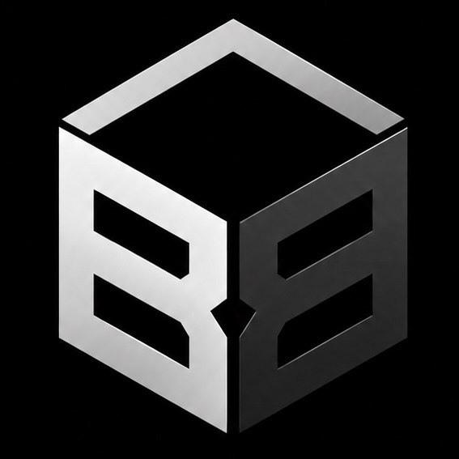

# Black Box Platform — Resumo Executivo

> Documento consolidado: visão, arquitetura, roadmap, status de implementação e como operar.
>
> **Última atualização:** Missões 01 e 02 concluídas · PRs [#145](https://github.com/octaviopucci/black-Box/pull/145), [#146](https://github.com/octaviopucci/black-Box/pull/146), [#147](https://github.com/octaviopucci/black-Box/pull/147)



---

## 1. O que é

**Black Box Platform** é um **Revenue Operating System** — sistema de vendas e operação para parceiros comerciais externos e equipe interna.

Permite que parceiros encontrem oportunidades, gerenciem leads, vendam serviços digitais, acompanhem comissões e monitorem a execução dos projetos vendidos.

**Não é:** Kiwify, checkout, afiliados tradicional, ERP, CRM genérico ou contabilidade.

**Posicionamento em 7 camadas:**

```
Aquisição → Vendas → Transação → Onboarding → Produção → Relacionamento → Inteligência
```

**Ciclo central do MVP:**

```
LEAD → VENDA → PAGAMENTO → COMISSÃO → BRIEFING → PRODUÇÃO → ENTREGA → UPSELL
```

---

## 2. Onde vive no repositório

| Área | Path | Papel |
|------|------|-------|
| **Plataforma (produto)** | `platform/` | App Next.js 15 — modular monolith |
| **Blueprint / docs** | `docs/black-box-platform/` | Spec, roadmap, decisões, briefs |
| **Monorepo legado** | `portal/`, `apps/`, `projects/` | Portal institucional + demos clientes (inalterados) |

A plataforma roda em **porta 3001** (`npm run dev:platform` na raiz).

---

## 3. Arquitetura (decisões fixas)

| Decisão | Escolha |
|---------|---------|
| Padrão | **Modular monolith multi-tenant** |
| Stack | Next.js 15 · TypeScript · Tailwind 4 · PostgreSQL · Prisma 6 · Zod · Vitest |
| IDs | UUID (nunca sequenciais expostos) |
| Auth | Sessão server-side + cookie httpOnly (Missão 02) |
| RBAC | Centralizado no backend — **Missão 03** ✅ |
| Tenant | `Organization` derivada da sessão, nunca do frontend |

### Regras que não podem ser violadas

1. **Lead ≠ Customer** — histórico preservado
2. **Product ≠ Offer** — Sale registra a Offer usada
3. **Sale ≠ Payment** — venda pode existir antes do pagamento
4. **Sale ≠ Commission** — comissão com ciclo próprio + snapshot
5. **CRM ≠ Produção** — pipelines separados
6. **Multi-tenancy no backend** — nunca confiar em `?organizationId=` do cliente
7. **Snapshots financeiros** — comissão congelada na venda
8. **Form versioning** — submissões preservam versão do formulário

Detalhe: [DECISIONS.md](./DECISIONS.md) · Spec completa: [SPECIFICATION.md](./SPECIFICATION.md)

---

## 4. Roadmap — 15 missões

```
                         ┌── 05 Leads ──→ 06 CRM ──┐
01 Fundação ✓            │                         │
      ↓                  │                         │
02 Auth + Org ✓          │                         │
      ↓                  │                         │
03 RBAC ✓                  │                         │
      ↓                  │                         │
04 Partners ✓ ───────────┤                         ├──→ 08 Sales + Customer
                         │                         │
                         └── 07 Products + Offers ─┘
                                      ↓
                              09 → 10 → 11 → 12 → 13 → 14 → 15
```

### Ondas paralelas (após Missão 04)

```
              ┌── 05 Leads → 06 CRM ──┐
04 Partners ──┤                         ├── 08 Sales + Customer
              └── 07 Products + Offers ─┘
```

Detalhe: [MISSIONS.md](./MISSIONS.md)

---

## 5. Status de implementação

| Missão | Nome | Status | PR |
|--------|------|--------|-----|
| 01 | Fundação técnica | ✅ Completa | [#146](https://github.com/octaviopucci/black-Box/pull/146) |
| 02 | Auth + Organization | ✅ Completa | [#147](https://github.com/octaviopucci/black-Box/pull/147) |
| 03 | RBAC + Authorization | ✅ Completa | [#148](https://github.com/octaviopucci/black-Box/pull/148) |
| 04 | Partners | ✅ Completa | — |
| 05–15 | Leads → Hardening | ⏳ Pendente | — |

Briefs entregues: [01-fundacao.md](./missions/01-fundacao.md) · [02-auth-organization.md](./missions/02-auth-organization.md) · [03-rbac-authorization.md](./missions/03-rbac-authorization.md) · [03-rbac-resumo.md](./missions/03-rbac-resumo.md)

---

## 6. Missão 01 — Fundação (entregue)

**Objetivo:** base técnica executável sem funcionalidade de negócio.

| Entrega | Detalhe |
|---------|---------|
| App | Next.js 15 em `platform/` |
| Banco | PostgreSQL + Prisma + migrations versionadas |
| Config | `src/config/env.ts` — env centralizado com Zod |
| Shared kernel | Logger, contrato de erro HTTP, helpers HTTP, client Prisma |
| Health | `GET /api/health` — app + conectividade DB |
| UI | App shell público, estados loading/error/empty |
| Testes | Vitest — env, errors, health, migration flow |

**Fora do escopo respeitado:** auth, RBAC, entidades de negócio, dashboards fake.

---

## 7. Missão 02 — Auth + Organization (entregue)

**Objetivo:** identidade + autenticação + sessão + tenant context.

### Modelo de dados

```
User ──N:N── OrganizationMembership ──N:N── Organization
  │
  └── Session (token hash, activeOrganizationId, expiresAt)
```

| Entidade | Campos-chave |
|----------|--------------|
| User | email (único, normalizado), passwordHash (Argon2id), name, status |
| Organization | name, slug (único), status |
| OrganizationMembership | userId + organizationId (unique), status |
| Session | tokenHash, activeOrganizationId, expiresAt |

### API

| Método | Rota | Função |
|--------|------|--------|
| POST | `/api/auth/login` | Autenticar, criar sessão |
| POST | `/api/auth/logout` | Invalidar sessão |
| GET | `/api/auth/me` | User + org ativa + orgs disponíveis |
| GET | `/api/organizations/current` | Organization ativa |
| POST | `/api/organizations/select` | Selecionar org (valida membership) |
| GET | `/api/health` | Health check (Missão 01, preservado) |

### Helpers server-side (contrato para Missão 03)

```typescript
getCurrentUser()
getCurrentOrganization()
requireAuthenticatedUser()
requireActiveOrganization()
```

Local: `platform/src/lib/auth/context.ts`

### Frontend

| Rota | Descrição |
|------|-----------|
| `/` | Home pública |
| `/login` | Login (email + senha) |
| `/app` | Área protegida (placeholder — não é dashboard funcional) |
| `/app/select-organization` | Seleção quando múltiplas memberships |

Middleware: cookie `bb_session` obrigatório em `/app/*`.

### Segurança implementada

- Senha nunca em plaintext — Argon2id
- Cookie httpOnly, Secure (prod), SameSite=Lax
- Credenciais inválidas → mensagem genérica (sem user enumeration)
- Usuário INACTIVE não autentica
- Org select valida membership — User A não acessa Org B via parâmetro
- Rate limiting simples no login (5 tentativas / 15 min)
- **Sem RBAC** — roles/permissões = Missão 03

### Bootstrap

```bash
npm run db:bootstrap   # idempotente — cria org + user + membership (sem roles)
```

Variáveis: `BOOTSTRAP_ORG_NAME`, `BOOTSTRAP_ORG_SLUG`, `BOOTSTRAP_USER_NAME`, `BOOTSTRAP_USER_EMAIL`, `BOOTSTRAP_USER_PASSWORD`

---

## 8. Missão 03 — RBAC + Authorization (entregue)

**Objetivo:** roles tenant-scoped, catálogo de permissions, gates server-side, tenant isolation.

### Modelo de dados

```
Organization
 ├── Role (tenant-scoped)
 │     └── RolePermission → Permission (global catalog)
 └── OrganizationMembership
       └── MembershipRole → Role
```

### Roles padrão (por organização)

| Slug | Escopo |
|------|--------|
| `admin` | Todas as permissions do catálogo |
| `gestor` | Permissions operacionais explícitas |
| `parceiro` | Permissions comerciais apenas |

### API pública de autorização

```typescript
import { PERMISSIONS, requirePermission, hasPermission } from '@/lib/authorization'
await requirePermission(PERMISSIONS.LEAD_CREATE)
```

Helpers: `hasAnyPermission`, `hasAllPermissions`, `hasRole`, `requireRole`, `getAuthorizationContext()`.

### Bootstrap (evoluído)

```bash
npm run db:bootstrap   # idempotente — org + user + membership + roles + permissions + ADMIN assignment
```

### Segurança

- **401** ausência/invalidade de autenticação · **403** autenticado sem autorização
- Tenant sempre derivado da sessão — nunca do frontend
- ADMIN é tenant-scoped (`ADMIN(X) ≠ ADMIN(global)`)
- Role INACTIVE, membership INACTIVE, org INACTIVE → deny
- Proteção contra privilege escalation e cross-tenant IDOR

---

## 9. Missão 04 — Partners (entregue)

**Objetivo:** primeira entidade de negócio — parceiro comercial tenant-scoped, separado de User.

### Modelo

```
Organization → Partner (userId opcional)
Status: PENDING | ACTIVE | INACTIVE
```

### API

| Método | Rota | Permission |
|--------|------|------------|
| GET | `/api/partners` | `partner.read` |
| POST | `/api/partners` | `partner.create` |
| GET/PATCH | `/api/partners/:id` | `partner.read` / `partner.update` |
| POST | `/api/partners/:id/activate` | `partner.activate` |
| POST | `/api/partners/:id/deactivate` | `partner.activate` |

### Frontend

`/app/partners` · `/app/partners/new` · `/app/partners/[id]`

---

## 10. Estrutura de código (`platform/`)

```
platform/
├── prisma/schema.prisma          # User, Organization, Membership, Session, Role, Permission
├── prisma/migrations/
├── database/bootstrap.ts         # Bootstrap idempotente + RBAC seed
├── src/
│   ├── app/
│   │   ├── api/auth/             # login, logout, me
│   │   ├── api/authorization/    # roles, permissions
│   │   ├── api/organizations/    # current, select, membership roles
│   │   ├── api/partners/         # partners CRUD + lifecycle
│   │   ├── api/health/
│   │   ├── login/
│   │   └── (authenticated)/app/  # área protegida + /partners
│   ├── config/env.ts
│   ├── lib/
│   │   ├── auth/                 # context, cookies, constants
│   │   ├── authorization/        # permissions, gates, context
│   │   ├── db.ts, errors.ts, logger.ts, http/
│   │   └── ...
│   ├── modules/
│   │   ├── auth/                 # domain, application, infrastructure
│   │   ├── organization/
│   │   ├── authorization/        # RBAC seed, role service
│   │   ├── partners/             # partner domain + service
│   │   └── foundation/
│   └── middleware.ts
└── tests/                        # 50 testes (unit + integration + auth + partners)
```

---

## 11. Como rodar localmente

```bash
cd platform
cp .env.example .env
# Preencher DATABASE_URL e AUTH_SECRET (mín. 32 caracteres)

npm install --legacy-peer-deps
npm run db:migrate:deploy
npm run db:bootstrap
npm run dev                    # http://localhost:3001
```

**Login bootstrap padrão** (`.env.example`):

- Email: `admin@blackbox.local`
- Senha: valor de `BOOTSTRAP_USER_PASSWORD`

**Da raiz do monorepo:**

```bash
npm run dev:platform
npm run test:platform
npm run build:platform
```

---

## 11. Variáveis de ambiente

| Variável | Obrigatória | Descrição |
|----------|-------------|-----------|
| `DATABASE_URL` | sim | PostgreSQL |
| `AUTH_SECRET` | sim | Mín. 32 chars |
| `NODE_ENV` | não | development / test / production |
| `LOG_LEVEL` | não | debug / info / warn / error |
| `SESSION_MAX_AGE_SECONDS` | não | TTL sessão (default 7 dias) |
| `BOOTSTRAP_*` | p/ bootstrap | Org + usuário inicial |

---

## 12. Comandos

| Comando | Função |
|---------|--------|
| `npm run dev` | Dev server (:3001) |
| `npm run build` | Build produção |
| `npm run test` | 50 testes Vitest |
| `npm run typecheck` | TypeScript |
| `npm run lint` | ESLint |
| `npm run db:migrate:deploy` | Aplicar migrations |
| `npm run db:bootstrap` | Criar org + user + RBAC inicial |
| `npm run db:generate` | Regenerar Prisma client |

---

## 13. Fluxo end-to-end do MVP (definição de pronto)

O produto só estará funcional quando este fluxo completo funcionar:

```
ADMIN cadastra/ativa PARCEIRO
  → PARCEIRO cria LEAD → OPPORTUNITY → pipeline → VENDA
  → ADMIN confirma PAGAMENTO
  → COMMISSION + BRIEF gerados
  → CLIENTE preenche briefing (link público)
  → EQUIPE cria PROJECT → produz → entrega
  → PARCEIRO acompanha venda, comissão e projeto
```

**Hoje:** fundação + identidade/tenant + RBAC + módulo Partners. O fluxo comercial completo depende das Missões 05–15.

---

## 14. Contrato arquitetural (fluxo de request)

```
REQUEST
   ↓
SESSION                    ← Missão 02 ✅
   ↓
USER
   ↓
ACTIVE MEMBERSHIP
   ↓
ORGANIZATION
   ↓
RBAC + AUTHORIZATION       ← Missão 03 ✅
   ↓
BUSINESS OPERATIONS        ← Missões 04–15 ⏳
```

**Regra de ouro:** o frontend nunca diz ao backend quem o usuário é ou qual tenant pode acessar. O servidor determina isso pela sessão e pelos relacionamentos persistidos.

---

## 15. Próximos passos

| Prioridade | Missão | Escopo |
|------------|--------|--------|
| **1** | 05 — Leads (paralelo 07) | Captura e gestão inicial de leads |
| **2** | 06 — CRM | Pipeline comercial |
| **3** | 08+ | Sales → Hardening |

Antes de implementar: copiar [MISSION-TEMPLATE.md](./MISSION-TEMPLATE.md) → `missions/NN-slug.md`.

---

## 16. Índice de documentação

| Documento | Conteúdo |
|-----------|----------|
| **[SUMMARY.md](./SUMMARY.md)** | Este resumo |
| [README.md](./README.md) | Índice + regras críticas |
| [SPECIFICATION.md](./SPECIFICATION.md) | Blueprint completo (108 seções) |
| [MISSIONS.md](./MISSIONS.md) | Grafo, ondas paralelas, 15 missões |
| [DECISIONS.md](./DECISIONS.md) | Decisões invioláveis |
| [MISSION-TEMPLATE.md](./MISSION-TEMPLATE.md) | Template de execução |
| [platform/README.md](../../platform/README.md) | Setup operacional |
| [missions/01-fundacao.md](./missions/01-fundacao.md) | Brief Missão 01 |
| [missions/03-rbac-authorization.md](./missions/03-rbac-authorization.md) | Brief Missão 03 |
| [missions/03-rbac-resumo.md](./missions/03-rbac-resumo.md) | Resumo executivo Missão 03 |

---

## 17. Testes (estado atual)

**50 testes passando** em `platform/tests/`:

- Unitários: env, errors, email, slug, password, permission catalog, partner status
- Integração: health, migration, auth, bootstrap RBAC
- Autorização: gates, tenant isolation, privilege escalation
- Partners: CRUD, RBAC, IDOR, user association, status transitions

```bash
cd platform && npm run test
```

---

## 18. O que explicitamente NÃO existe ainda

- Lead, CRM, Product, Sale, Commission
- Brief, Project, Dashboard funcional
- Notificações, AuditLog
- Gateway, checkout, WhatsApp, IA
- Signup público, password reset, MFA, SSO
